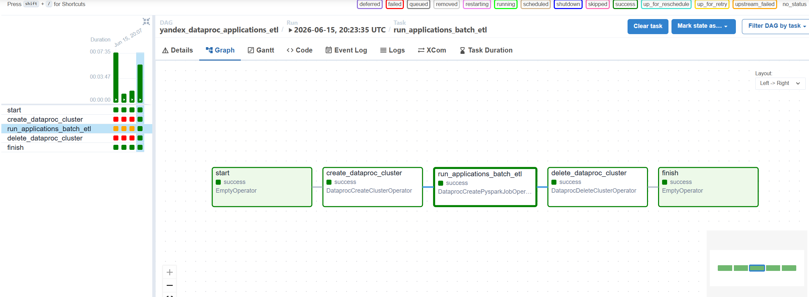
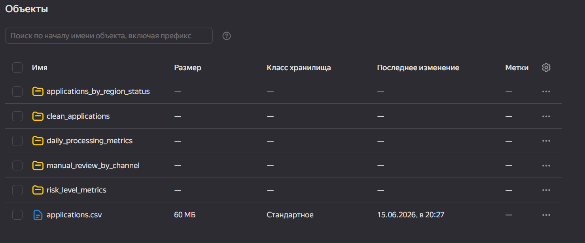
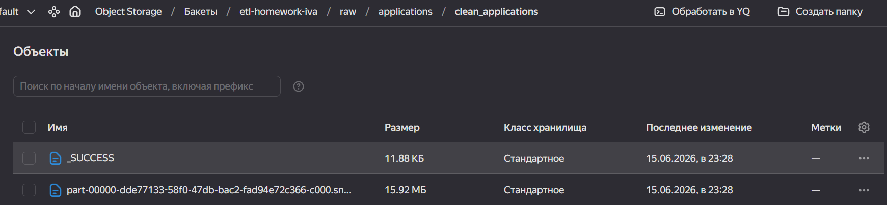
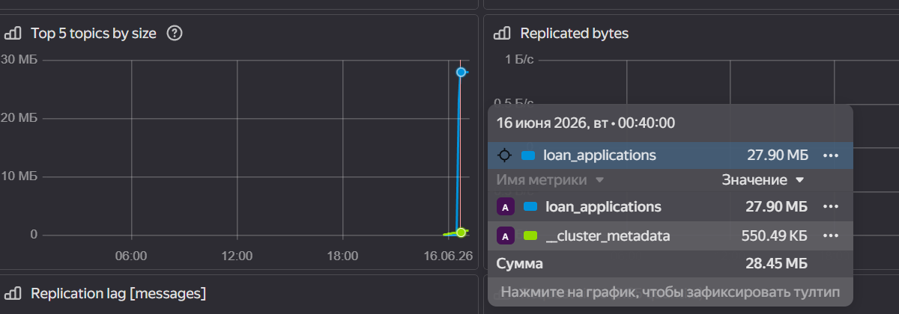
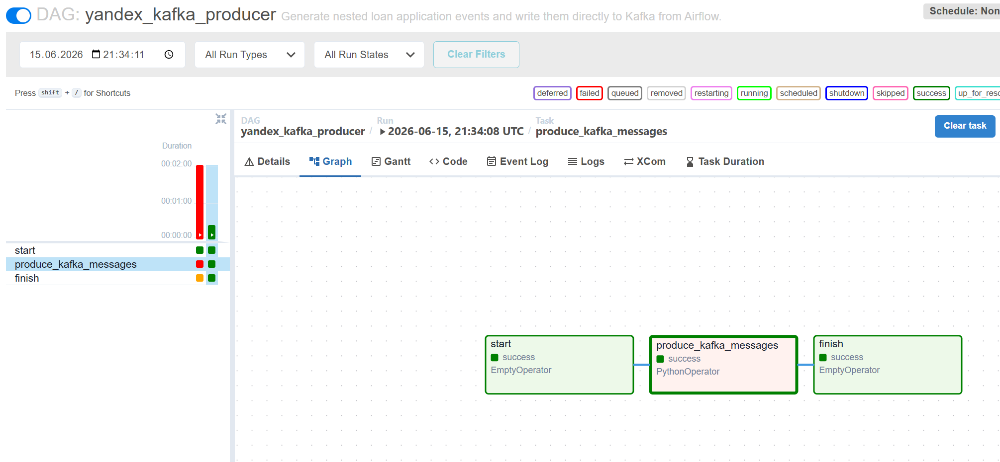

# ETL Homework: Yandex Cloud Data Platform

Практическая работа по дисциплине «ETL-процессы». В работе реализован контур обработки данных в Yandex Cloud: перенос данных из YDB в Object Storage через Data Transfer, batch-обработка файлов через Airflow и Yandex Data Processing, отправка Kafka-событий и подготовка PySpark-задания для раскладывания вложенного JSON в плоский вид.

## Общая Архитектура

Использованные сервисы Yandex Cloud:

- Yandex Database;
- Yandex Data Transfer;
- Yandex Object Storage;
- Managed Service for Apache Airflow;
- Yandex Data Processing;
- Managed Service for Apache Kafka;
- Yandex DataLens.

Общий список созданных сервисов:


Структура Object Storage:


## Структура Репозитория

- `sql/ydb/` - YQL-скрипты для таблицы `transactions_v2`.
- `scripts/` - генераторы тестовых данных и CLI Kafka producer.
- `airflow/dags/` - DAG-файлы для batch ETL, Kafka producer и Kafka flatten job.
- `spark/` - PySpark batch и Kafka streaming задания.
- `data-samples/` - маленькие примеры входных данных.
- `docs/` - инструкции и скриншоты выполнения заданий.

## Задание 1: YDB -> Object Storage

Для первого задания была создана база YDB и таблица `transactions_v2` по схеме из задания. SQL-скрипт находится в [`sql/ydb/create_transactions_v2.yql`](sql/ydb/create_transactions_v2.yql).

Данные были сгенерированы локально командой:

```bash
python scripts/generate_transactions_v2.py --output data/transactions_v2.csv --target-mb 35
```

Полученный файл объёмом около 35 МБ был загружен в таблицу `transactions_v2`. После этого был настроен Data Transfer из YDB в Object Storage с выходным форматом Parquet и сжатием Snappy. Для Parquet была увеличена группа строк, чтобы избежать ошибки превышения лимита row groups.

Созданная YDB:


Настроенный transfer в Object Storage:


Успешное выполнение Data Transfer:


## Задание 2: Airflow + Data Processing + PySpark Batch

Для второго задания был подготовлен входной файл `applications.csv` объёмом более 50 МБ:

```bash
python scripts/generate_applications.py --output data/applications.csv --target-mb 60
```

Файл был загружен в Object Storage в `raw/applications/`. PySpark-скрипт [`spark/applications_batch_etl.py`](spark/applications_batch_etl.py) был загружен в `scripts/` в Object Storage.

Для автоматизации был создан DAG [`airflow/dags/yandex_dataproc_etl_dag.py`](airflow/dags/yandex_dataproc_etl_dag.py). Он выполняет полный цикл:

1. Создаёт временный кластер Yandex Data Processing.
2. Запускает PySpark batch job.
3. Записывает результат в `processed/applications/`.
4. Удаляет временный кластер.

PySpark job формирует витрины:

- `clean_applications`;
- `applications_by_region_status`;
- `risk_level_metrics`;
- `manual_review_by_channel`;
- `daily_processing_metrics`.

Успешный запуск DAG:



Результаты после выполнения DAG в Object Storage:



Пример очищенных данных в S3:



## Задание 3: Kafka + PySpark Streaming

Для третьего задания был создан Managed Kafka topic `loan_applications`. Для генерации сообщений подготовлены два варианта:

- CLI-скрипт [`scripts/produce_kafka_applications.py`](scripts/produce_kafka_applications.py);
- Airflow DAG [`airflow/dags/yandex_kafka_producer_dag.py`](airflow/dags/yandex_kafka_producer_dag.py), который сам отправляет JSON-сообщения в Kafka.

Сообщения имеют вложенную структуру: `application_id`, `customer`, `loan`, `scoring`, `documents`, `decision_status`, `submitted_at`. Объём отправки настроен через Airflow variable `KAFKA_PRODUCER_TARGET_MB`, для задания использовался объём не менее 20 МБ.

Созданный Kafka topic:



Успешная отправка сообщений в Kafka:



Для обработки Kafka-сообщений подготовлен PySpark-скрипт [`spark/kafka_streaming_flatten.py`](spark/kafka_streaming_flatten.py). Он читает сообщения из Kafka, парсит JSON по явной схеме, разворачивает массив `documents` и сохраняет плоский результат в Object Storage. Для запуска через Airflow подготовлен DAG [`airflow/dags/yandex_dataproc_kafka_flatten_dag.py`](airflow/dags/yandex_dataproc_kafka_flatten_dag.py), который создаёт Data Processing кластер, запускает PySpark job и удаляет кластер после выполнения.

## Основные Скрипты

- [`sql/ydb/create_transactions_v2.yql`](sql/ydb/create_transactions_v2.yql) - создание таблицы YDB.
- [`scripts/generate_transactions_v2.py`](scripts/generate_transactions_v2.py) - генерация данных для Data Transfer.
- [`scripts/generate_applications.py`](scripts/generate_applications.py) - генерация batch-файла.
- [`airflow/dags/yandex_dataproc_etl_dag.py`](airflow/dags/yandex_dataproc_etl_dag.py) - batch ETL DAG.
- [`airflow/dags/yandex_kafka_producer_dag.py`](airflow/dags/yandex_kafka_producer_dag.py) - Kafka producer DAG.
- [`airflow/dags/yandex_dataproc_kafka_flatten_dag.py`](airflow/dags/yandex_dataproc_kafka_flatten_dag.py) - Kafka flatten DAG.
- [`spark/applications_batch_etl.py`](spark/applications_batch_etl.py) - PySpark batch ETL.
- [`spark/kafka_streaming_flatten.py`](spark/kafka_streaming_flatten.py) - PySpark Kafka flatten job.
