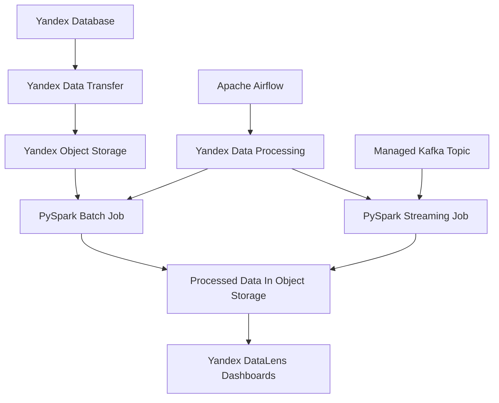

# ETL Homework: Yandex Cloud Data Platform

Практическая работа по дисциплине «ETL-процессы»

## Архитектура



## Структура репозитория

- `sql/ydb/` - YQL-скрипты для таблицы `transactions_v2`.
- `airflow/dags/` - DAG для создания кластера Yandex Data Processing, запуска PySpark и удаления кластера.
- `spark/` - PySpark batch и streaming задания.
- `scripts/` - генерация тестовых данных и отправка JSON-сообщений в Kafka.
- `docs/` - инструкции по инфраструктуре, DataTransfer, Kafka и DataLens.
- `data-samples/` - небольшие примеры данных и схемы.

## Object Storage Layout

```text
raw/transactions_v2/       # выгрузка YDB -> Object Storage через Data Transfer
raw/applications/          # входные batch-файлы не менее 50 Мб
processed/applications/    # агрегаты PySpark batch
processed/kafka_flat/      # плоский результат Kafka streaming
checkpoints/kafka_flat/    # Spark checkpoint для streaming job
scripts/                   # PySpark-скрипты для запуска из Data Processing
```

## Задание 1: YDB -> Object Storage

1. Создать YDB database в Yandex Cloud.
2. Выполнить [`sql/ydb/create_transactions_v2.yql`](sql/ydb/create_transactions_v2.yql).
3. Сгенерировать CSV объёмом не менее 30 Мб:

```bash
python scripts/generate_transactions_v2.py --output data/transactions_v2.csv --target-mb 35
```

4. Загрузить данные в YDB.
5. Создать Data Transfer: source `YDB`, target `Object Storage`, путь `raw/transactions_v2/`.
6. Запустить transfer и проверить появление файлов в bucket.

Артефакты для отчёта: скриншот таблицы YDB, настройки transfer, успешный статус transfer, файлы в Object Storage.

## Задание 2: Airflow + Data Processing + PySpark Batch

1. Сгенерировать входной файл:

```bash
python scripts/generate_applications.py --output data/applications.csv --target-mb 60
```

2. Загрузить файл в `s3://<bucket>/raw/applications/applications.csv`.
3. Загрузить [`spark/applications_batch_etl.py`](spark/applications_batch_etl.py) в `s3://<bucket>/scripts/applications_batch_etl.py`.
4. Настроить переменные Airflow из [`docs/airflow-variables.md`](docs/airflow-variables.md).
5. Разместить [`airflow/dags/yandex_dataproc_etl_dag.py`](airflow/dags/yandex_dataproc_etl_dag.py) в Managed Service for Apache Airflow.
6. Запустить DAG и проверить, что результат появился в `processed/applications/`, а кластер удалён.

PySpark job создаёт агрегаты:

- `applications_by_region_status`
- `risk_level_metrics`
- `manual_review_by_channel`
- `daily_processing_metrics`

## Задание 3: Kafka + PySpark Streaming

1. Создать Managed Service for Apache Kafka и topic, например `loan_applications`.
2. Сгенерировать и отправить JSON-сообщений:

```bash
python scripts/produce_kafka_applications.py --bootstrap-servers <host:9091> --topic loan_applications --target-mb 25
```

3. Загрузить [`spark/kafka_streaming_flatten.py`](spark/kafka_streaming_flatten.py) в Object Storage.
4. Запустить PySpark streaming job в Yandex Data Processing.
5. Проверить плоский результат в `processed/kafka_flat/`.

## Задание 4: DataLens

DataLens подключается к подготовленным агрегатам. Если прямое чтение из Object Storage недоступно в вашем окружении, загрузите агрегаты в YDB или ClickHouse и подключите DataLens к этому хранилищу.

Рекомендуемые графики:

- количество заявок по дням;
- решения по регионам;
- средний скоринг и сумма заявки по уровню риска;
- доля manual review по каналам;
- количество streaming-событий и распределение документов.

Подробный чек-лист дашборда находится в [`docs/datalens-dashboard.md`](docs/datalens-dashboard.md).

## Финальная проверка

- Репозиторий GitHub открыт публично.
- В репозитории нет `.env`, ключей, токенов, JSON-файлов сервисных аккаунтов и больших датасетов.
- README содержит описание всех четырёх заданий.
- Все SQL, DAG и PySpark-скрипты сохранены в репозитории.
- В `docs/screenshots/` добавлены скриншоты успешных запусков.
- Неиспользуемые облачные ресурсы остановлены или удалены.

## Вывод

В результате работы получается end-to-end ETL/Streaming контур: данные переносятся из YDB в Object Storage, batch-файлы обрабатываются Spark-заданием под управлением Airflow, Kafka-события раскладываются в плоскую структуру, а итоговые агрегаты визуализируются в DataLens.
